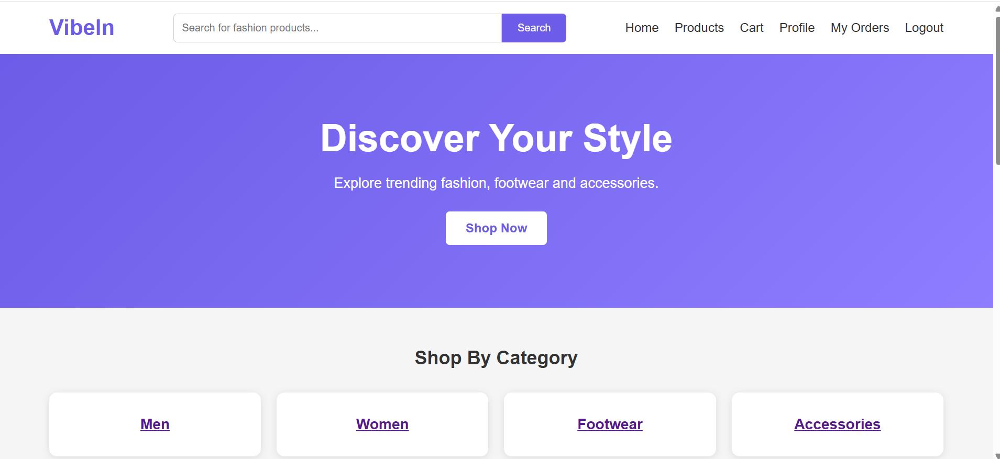
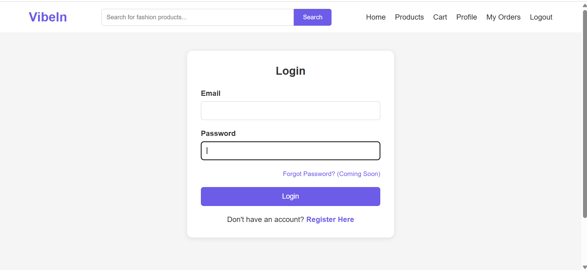
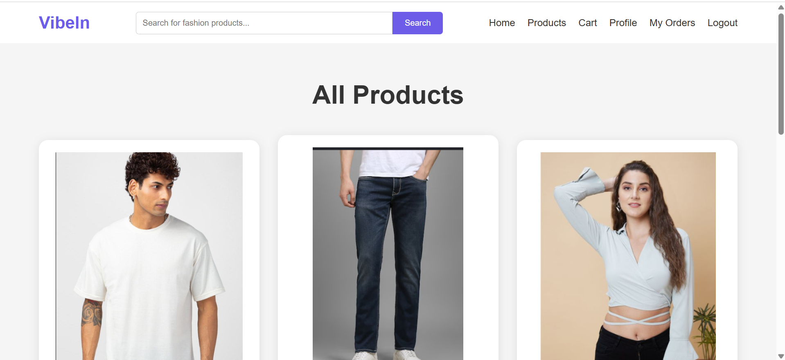
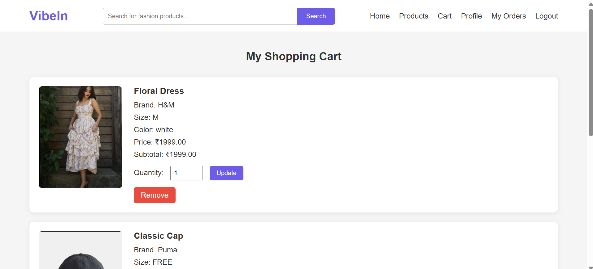
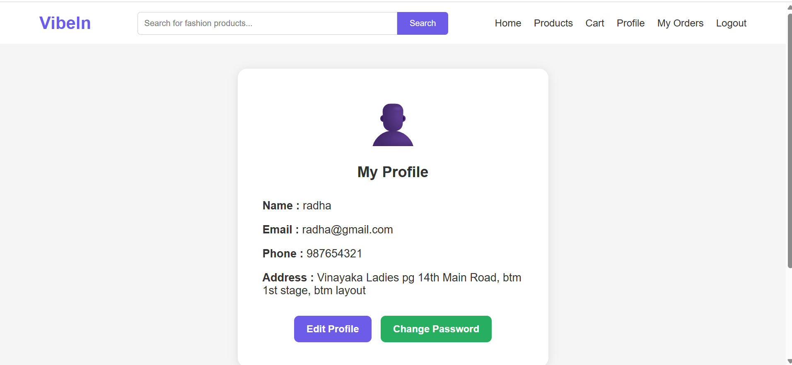

# 🛒 VibeIn E-Commerce Application

## 📌 Overview

VibeIn is a Java-based E-Commerce Web Application developed using Servlets, JSP, JDBC, and MySQL following the MVC Architecture.

---

## 🚀 Features

### User Management
- User Registration
- User Login and Logout
- Session Management
- Password Change
- Profile Update

### Product Management
- Product Listing
- Product Details

### Shopping Cart
- Add to Cart
- Update Quantity
- Remove Product

### Checkout
- Checkout Functionality

### Database Integration
- JDBC Connectivity
- MySQL Database

---

## 🏗 Architecture

This project follows the MVC Architecture.

### Model
Contains Java classes and DAO implementations.

### View
Implemented using JSP, HTML and CSS.

### Controller
Implemented using Servlets.

---

## 🛠 Technologies Used

- Java
- JSP
- Servlets
- JDBC
- MySQL
- HTML
- CSS
- Maven
- Apache Tomcat
- MVC Architecture

---

## 📂 Project Structure

```
src
└── main
    ├── java
    │     └── com.vibein
    │           ├── controller
    │           ├── dao
    │           ├── daoimpl
    │           ├── model
    │           └── utility
    │
    └── webapp
           ├── assets
           ├── css
           ├── images
           ├── js
           └── WEB-INF
```

---

## 📸 Screenshots

### Home Page



### Login Page



### Product Page



### Shopping Cart



### Profile Page



---

## ⚙ Setup Instructions

### Clone Repository

```bash
git clone https://github.com/Udbhavi11/VibeIn-Ecommerce-Application.git
```

### Import into Eclipse

Import as Maven Project.

### Configure Database

Update database credentials inside:

```
DBConnection.java
```

### Run on Apache Tomcat

```
http://localhost:8080/VibeIn
```

---

## 👩‍💻 Author

**Udbhavi NM**

GitHub:
https://github.com/Udbhavi11
